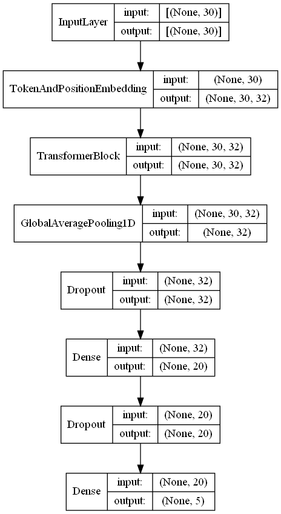

Implementación para Curso de Seminario 2 (2021-2), Universidad de Lima

# Estructura de Modelos:
|BLSTM|Transformer|
|:---:|:---------:|
|||

 

# Matrizes de Confusion
|BLSTM|Transformer|
|:---:|:---------:|
|||

 

# Reportes
<!-- CSV to MD Table: https://www.convertcsv.com/csv-to-markdown.htm -->
## BLSTM
|            |precision|recall|f1-score|support|
|:----------:|:-------:|:----:|:------:|:-----:|
|   anger    |  0.87   | 0.79 |  0.83  |275    |
|    fear    |  0.80   | 0.82 |  0.81  |224    |
|    joy     |  0.84   | 0.92 |  0.88  |695    |
|   other    |  0.69   | 0.56 |  0.62  |225    |
|  sadness   |  0.89   | 0.88 |  0.89  |581    |
| macro avg  |  0.82   | 0.80 |  0.80  |2000   |
|weighted avg|  0.84   | 0.84 |  0.84  |2000   |
|
|  accuracy  ||  0.84  |
|train time  || 49.73  |

 

## Transformer

|            |precision|recall|f1-score|support|
|:----------:|:-------:|:----:|:------:|:-----:|
|   anger    |  0.90   | 0.79 |  0.84  |275    |
|    fear    |  0.82   | 0.83 |  0.82  |224    |
|    joy     |  0.88   | 0.91 |  0.89  |695    |
|   other    |  0.69   | 0.72 |  0.70  |225    |
|  sadness   |  0.90   | 0.89 |  0.90  |581    |
| macro avg  |  0.84   | 0.83 |  0.83  |2000   |
|weighted avg|  0.86   | 0.86 |  0.86  |2000   |
|
|  accuracy  ||  0.86  |
| train time || 37.23  |
 

# Comparacion
||BLSTM|Transformer|
|:-:|:---:|:---------:|
|Valor F1 |0.84|0.86|
|Presición|0.84|0.86|
|Exactitud|0.84|0.86|
|Tiempo en entrenamiento|49.73|37.23