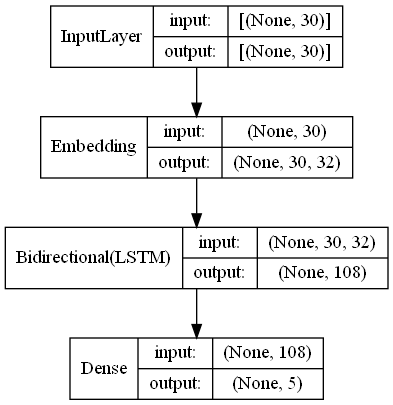

# Camino a un modelo ECM
Implementacion preliminr de un sistema ECM Seq2Seq.

Curso de Seminario 1, Universidad de Lima, 2020
## Progreso actual: 
* Constuccion de base de dtos de salud mental anotada con emociones (EMHD)
* Modelo BLSTM para categorizacion de emociones

## Modelo BLSTM:

## Reportes Generados:
**Matriz de Confusion de modelo BLSTM EDNLP (Normalizado en ele eje de Prediccion)**

**Reporte de Clasificacion de modelo BLSTM EDNLP**
|            |precision|recall|f1-score|support|
|------------|---------|------|--------|-------|
|anger       |0.86     |0.83  |0.85    |275.00 |
|fear        |0.78     |0.84  |0.81    |224.00 |
|joy         |0.91     |0.83  |0.87    |695.00 |
|other       |0.61     |0.75  |0.67    |225.00 |
|sadness     |0.90     |0.91  |0.90    |581.00 |
|accuracy    |0.84     |0.84  |0.84    |0.84   |
|macro avg   |0.81     |0.83  |0.82    |2000.00|
|weighted avg|0.85     |0.84  |0.85    |2000.00|

**Distribucion de emocion en publicaciones y sus respuestas:**
